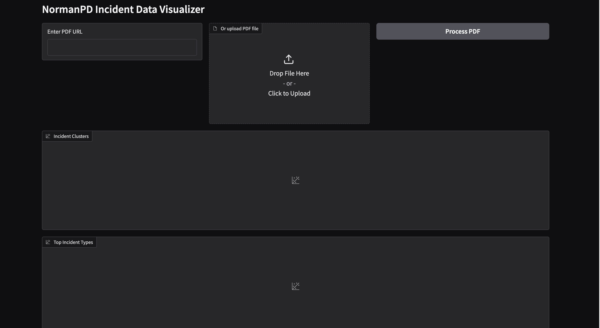

# NormanPD Incident Data Visualizer

## Overview

The **NormanPD Incident Data Visualizer** is a Python application that processes police incident data from PDFs, either uploaded or provided via URL. It extracts key details like incident number, location, and nature, and generates visualizations for analysis. The app uses `Gradio` for the interface and integrates libraries like `Pandas`, `Matplotlib`, and `scikit-learn`.

## Features

- **Download PDF from URL**: Retrieves the incident report PDF from a provided URL.
- **Extract Incident Data**: Utilizes regex patterns to extract key details such as the incident number, location, nature, and more.
- **Store Data in DataFrame**: Organizes the extracted data into a `Pandas` DataFrame for easy manipulation and visualization.
- **Generate Visualizations**: Creates multiple types of visualizations based on the data, such as clustering and distribution charts.

## Requirements

- **Python Version**: Python 3.x
- **Required Libraries**:  
  - `gradio`  
  - `pandas`  
  - `matplotlib`  
  - `seaborn`  
  - `scikit-learn`  
  - `requests`  
  - `pypdf`

## Installation Instructions

1. **Install Pipenv**:  
   Install `pipenv` if you don’t have it:
   ```bash
   pip install pipenv
   ```

2.  **Activate Virtual Environment**:  
   Activate the environment with:
   ```bash
   pipenv shell
   ```


3.  **Install Dependencies**:  
   Install the required libraries using:
   ```bash
   pipenv install 
   ```
   This will install all the dependencies from the `pipfile`.

4. **Run the Application**:  
   Ensure your project directory has the necessary files and then launch the app using:
   ```bash
   python app.py
   ```

## How to Run the Application

1. **Process Incident PDF**:  
   To process a PDF from a specified URL, use the following command:
   ```bash
   pipenv run main.py 
   ```
   A webpage will be opened at `5003` port number. In that webpage, you can give the `url to the pdf` or you can `upload the Norman pdf file from the local machine` and then click on `Process PDF button`.


2. **View Visualizations**:  
   The app will process the PDF, extract the data, and display relevant visualizations based on the extracted incident data.

## Webpage 


## Functions

### `process_input(url_input, file_input)`
  - **Description**: Processes the input PDF (from URL or file upload), extracts incident data, and generates visualizations.
  - **Outputs**: Multiple plots for visualizing incident data.

### `create_cluster_plot(df)`
  - **Description**: Generates a scatter plot showing clusters of incident data based on the nature of incidents.

### `create_bar_plot(df)`
  - **Description**: Creates a bar chart showing the distribution of top incident originating agencies.

### `create_heatmap(df)`
  - **Description**: Generates a heatmap to visualize the relationship between incident types and locations.

### `create_pie_chart(df)`
  - **Description**: Generates a pie chart showing the distribution of top incident types.

## Test Cases

### `test_extract_incident_data`
- **Description**: Verifies that incident data is correctly extracted from a sample PDF, ensuring correct date, nature, and ORI details.

### `test_fetch_pdf_from_url_local_file`
- **Description**: Tests fetching PDF data from a local file path, confirming the data is correctly read into a `BytesIO` object.

### `test_fetch_pdf_from_url_link`
- **Description**: Mocks and tests fetching a PDF from a URL, confirming the content is correctly retrieved into a `BytesIO` object.

### `test_create_cluster_plot`
- **Description**: Validates that the cluster plot function generates a valid matplotlib figure from incident data.

### `test_create_bar_plot`
- **Description**: Ensures the bar plot function generates a valid matplotlib figure displaying the distribution of agencies.

### `test_create_heatmap`
- **Description**: Tests the creation of a heatmap to visualize relationships between incident types and locations.

### `test_create_pie_chart`
- **Description**: Ensures that the pie chart function creates a valid matplotlib figure for incident type distribution.

### `test_gradio_page_generated`
- **Description**: Confirms that the Gradio web page is successfully generated and accessible on the correct local server port.

## Running Tests

To ensure everything is working correctly, you can run tests with `pytest`:
```bash
pipenv run pytest -v
```

## Bugs and Assumptions

- **Assumptions**:
  - The input PDF follows a consistent format.
  - The extraction logic assumes the location and nature data are correctly formatted.
  
- **Bugs**:
  - Changes to the PDF structure may require adjustments to the extraction logic.
  - Network errors during PDF download are not currently handled.

## Video Demonstration

[Project Demo](https://youtu.be/VY0aQRCT_2w)